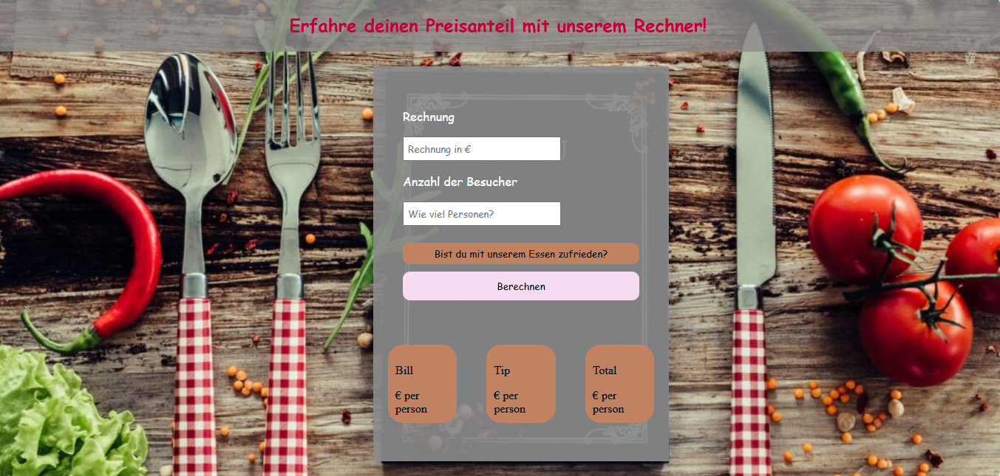

# 🧮 Bill Split and Tip Calculator Web App

A simple and responsive **Bill Split & Tip Calculator** that helps users divide the bill between guests and optionally include a tip based on service quality.

---

Please open the app here: https://split-my-bill-now.netlify.app/

DEMO

## ✨ Features

- Enter bill total and number of people
- Choose a tip percentage (optional)
- Instantly see:
  - Price per person
  - Tip per person
  - Total per person
- Beautiful background and Google Fonts
- Mobile-responsive design
- Smooth alert handling with SweetAlert2

---

## 💻 Technologies Used

- HTML5
- CSS3
- JavaScript (Vanilla)
- SweetAlert2 (for error messages)
- Google Fonts

---

## 📱 Mobile Friendly

The layout adapts to mobile screens (≤500px) for a smooth user experience on smartphones.

---

## 🚀 How to Use

1. Clone the repository or download the files
2. Open `index.html` in your browser
3. Enter the **bill amount** and **number of people**
4. (Optional) Click the *"Bist du mit unserem Essen zufrieden?"* button to select a tip
5. Click **"Berechnen"**
6. See the split values instantly!

---

📌 License This project is open-source and available under the MIT License.

This project was created as part of a learning exercise and is intended for educational use only.

Feel free to ask questions or suggest improvements!
